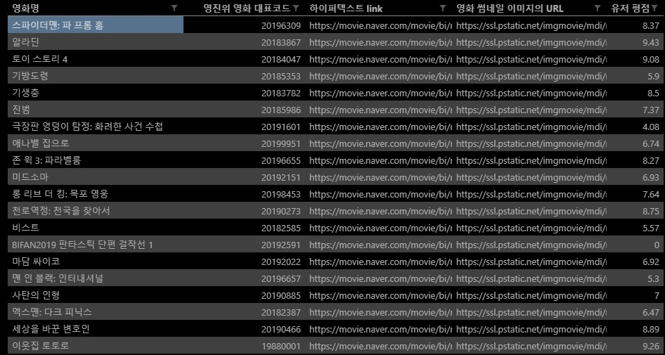

# 02 - 파이썬을 활용한 데이터 수집 II

## 코드 분석

### movie_naver.py

```python
import requests
import time
import csv
import re
from pprint import pprint
from decouple import config
 

 # html을 requests하면서 딸려오는 <br>을 제거하는 함수.
def remove_tag(content):
   cleanr =re.compile('<.*?>')
   cleantext = re.sub(cleanr, '', content)
   return cleantext

# 변수 초기화
M_codes = []
M_names = []
M_Enames = []
m_list = []
count = 0

#movie.csv에서 영화 대표코드와 영화명(국문), 영화명(영문) 데이터를 읽어 리스트에 저장.
with open('movie.csv', 'r', newline='', encoding='utf-8') as fr :
    reader = csv.DictReader(fr)   
    for row in reader :
        M_codes.append(row['영화 대표코드'])
        M_names.append(row['영화명(국문)'])
        M_Enames.append(row['영화명(영문)'])

# 데이터 쓰기. 
with open('movie_naver.csv', 'w', newline='', encoding='utf-8') as fnew:
    fieldnames = ('영화명', '영진위 영화 대표코드', '하이퍼텍스트 link', '영화 썸네일 이미지의 URL', '유저 평점')
    writer = csv.DictWriter(fnew, fieldnames=fieldnames)
    writer.writeheader()

    # 반복문을 활용해 영화명 리스트로 requests를 수행한다.
    for M_name in M_names :

        #너무 빠른 속도로 요청할 경우 거부당할 수 있기 때문에 0.1초 텀을 둔다.
        time.sleep(0.1)

        #requests
        BASE_URL = 'https://openapi.naver.com/v1/search/movie.json'
        HEADERS = {
            'X-Naver-Client-id' : config('CLIENT_ID'),
            'X-Naver-Client-Secret' : config('CLIENT_SECRET'),
        }
        query = M_name
        API_URL = f'{BASE_URL}?query={query}'
        response = requests.get(API_URL, headers=HEADERS).json()
        pprint(response)

        # route에 response 딕셔너리의 item 리스트로 접근한다.
        route = response['items']
        # for문을 활용하여 item 리스트에 있는 딕셔너리에 하나씩 접근한다.
        for item in route :
            # 만약 route리스트의 원소가 하나만 있다면 그 item을 info에 대입한다.
            if len(route) == 1 :
                info = item
            # 그렇지 않다면 첫번째로 item 딕셔너리의 title과 한글 영화제목을 비교한다.
            # 맞다면 for문을 빠져나온다.
            else :  
                if  remove_tag(item['title']) == query :
                    info = item
                    break
                # 한글 영화제목이 일치하지 않으면 영어 제목을 비교한다.
                # 대문자와 소문자의 혼용으로 일치하지 않을 수 있기 때문에 lower 함수를
                # 사용하여 소문자로 비교한다.     
                elif remove_tag(item['subtitle']).lower() == M_Enames[count].lower() :
                    info = item
                    break

        # 추출해온 info에서 알맞는 정보를 입력한다.
        data = {
                    '영화명' : remove_tag(info['title']),
                    '영진위 영화 대표코드' : M_codes[count],
                    '하이퍼텍스트 link' : info['link'],
                    '영화 썸네일 이미지의 URL' : info['image'],
                    '유저 평점' : info['userRating'],
                    }
        # data를 파일에 기록한다.
        writer.writerow(data)
            
        count += 1

```


### movie_naver.csv 데이터 크롤링 결과



### image_naver.py

```python
import requests
import csv
Thumb_url = []
M_code = []

# movie_naver.csv에서 영화 썸네일 이미지의 URL과 영진위 영화 대표코드를 읽어온다.
with open('movie_naver.csv', 'r' , newline='', encoding='utf-8') as fr :
    reader = csv.DictReader(fr)   
    for row in reader :
        Thumb_url.append(row['영화 썸네일 이미지의 URL'])
        M_code.append(row['영진위 영화 대표코드'])

# for문을 활용하여 image파일의 이름을 영진위 영화 대표코드로 하고 저장한다.
for i in range(len(M_code)) :
    with open(f'images/{M_code[i]}.jpg', 'wb') as f:
        response = requests.get(Thumb_url[i])
        f.write(response.content)

```


### 이미지 크롤링 결과


